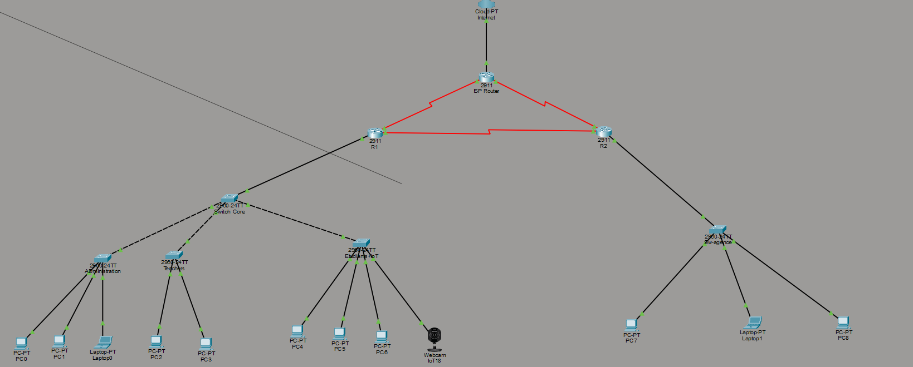

# 🏢 Enterprise Network Infrastructure Design using Cisco Packet Tracer

## 📌 Project Overview

This project presents the design and implementation of a secure multi-site enterprise network using Cisco Packet Tracer.

The objective is to simulate a realistic enterprise infrastructure that ensures secure communication between different departments while providing efficient routing, network segmentation, and Internet connectivity.

The project was developed as part of my engineering studies in Cybersecurity and Digital Trust at ENSAJ (National School of Applied Sciences of El Jadida).

---

# 🎯 Objectives

The main objectives of this project are:

- Design a scalable enterprise network.
- Separate departments using VLANs.
- Configure communication between VLANs.
- Implement dynamic routing using OSPF.
- Connect two remote sites through a GRE Tunnel.
- Secure network traffic using Access Control Lists (ACLs).
- Provide Internet access using NAT/PAT.
- Simulate a real enterprise network architecture.

---

# 🛠️ Technologies Used

- Cisco Packet Tracer
- Cisco IOS
- VLAN
- Inter-VLAN Routing
- OSPF (Open Shortest Path First)
- GRE Tunnel
- NAT/PAT
- Access Control Lists (ACL)
- IPv4 Addressing

---

# 🏗️ Network Architecture

The simulated infrastructure contains two connected sites:

## Main Campus

- Core Switch
- Router
- Multiple VLANs
- Internet Connection

## Remote Branch

- Router
- Local Network
- GRE Tunnel Connection

The communication between the two sites is established through a GRE Tunnel while OSPF dynamically exchanges routing information.

---

# 🌐 VLAN Configuration

The enterprise network is divided into several VLANs to isolate departments.

Example:

- VLAN 10 – Administration
- VLAN 20 – Teachers
- VLAN 30 – Students
- VLAN 40 – IoT Devices

Each VLAN has its own IP subnet and default gateway.

---

# 🔀 Routing

The project uses OSPF as the dynamic routing protocol.

OSPF automatically exchanges routes between routers and guarantees efficient communication across the network.

---

# 🔒 Network Security

Security mechanisms implemented in this project include:

- Access Control Lists (ACL)
- VLAN Segmentation
- GRE Tunnel
- NAT/PAT
- Private IP Addressing

These mechanisms improve confidentiality, network segmentation and traffic control.

---

# 🌍 Internet Access

Internet connectivity is provided using NAT/PAT.

Private IP addresses are translated into a public IP address allowing internal devices to communicate with external networks.

---

# 📂 Repository Contents

This repository contains:

- Enterprise-Network.pkt
- Project-Report.pdf
- Network-Topology.png
- README.md

---

# 🖼️ Network Topology

Insert the network topology image below.

```markdown

```

---

# 📚 Skills Demonstrated

This project demonstrates practical knowledge in:

- Enterprise Network Design
- Cisco Configuration
- Routing and Switching
- VLAN Configuration
- Dynamic Routing (OSPF)
- GRE Tunnel Configuration
- Access Control Lists
- NAT/PAT
- Network Troubleshooting
- Network Security Fundamentals

---

# 🚀 Future Improvements

Possible future enhancements include:

- Firewall implementation
- VPN deployment
- IPv6 Support
- High Availability (HSRP)
- QoS Configuration
- IDS/IPS Integration
- Wireless Network Integration

---

# 👩‍💻 Author

**Hiba Sabir**

Engineering Student in Cybersecurity & Digital Trust

National School of Applied Sciences of El Jadida (ENSAJ)

Morocco

---

⭐ Thank you for visiting this repository. Feel free to explore the project and its documentation.
